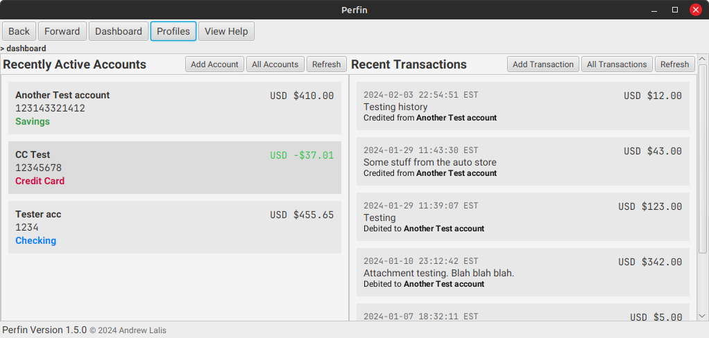

# Perfin

A personal accounting desktop app to track your finances using an approachable
interface and interoperable file formats for maximum compatibility.

## Download

Head to the [releases](https://github.com/andrewlalis/perfin/releases) page and
find the installer that's compatible for your system.

> No compatible release for your system? [Report it here.](https://github.com/andrewlalis/perfin/issues)

## About Perfin

Perfin is a desktop app built with Java 21 and JavaFX. It's intended to be used
by individuals to track their finances across multiple accounts (savings,
checking, credit, etc.).

Because the app lives and works entirely on your local computer, you can rest
assured that your data remains completely private.

Currently, the application is still a work-in-progress, and is not yet suitable
for actual usage with your real financial data, so stay tuned for updates.

# Release Procedure

Platform-specific package installers are generated automatically via GitHub
Actions (see `.github/workflows/make-release.yaml`), which is triggered by a
new tag being pushed to the `main` branch. Follow these steps to push a release:

1. Run `java scripts/SetVersion.java 1.2.3` (replacing `1.2.3` with the new version number)
to set the version everywhere that it needs to be.
2. Add a tag to the `main` branch with `git tag v1.2.3`.
3. Push the tag to GitHub with `git push origin v1.2.3`.

Once that's done, the workflow will start, and you should see a release appear
in the next few minutes.
